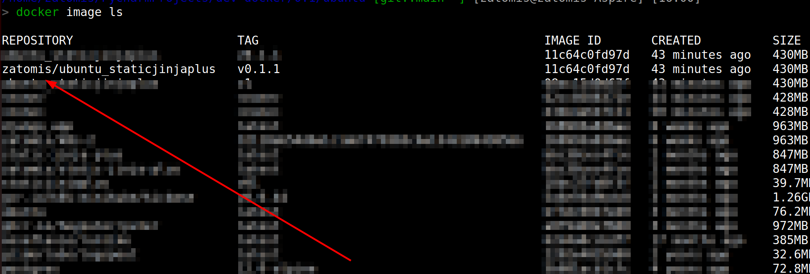
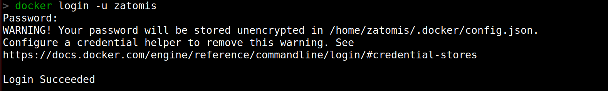
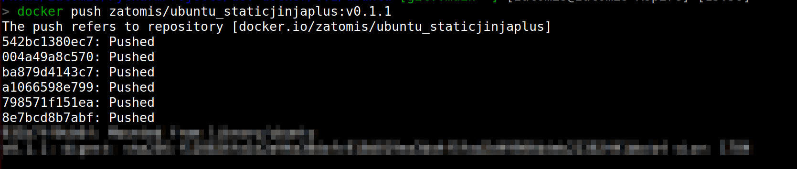
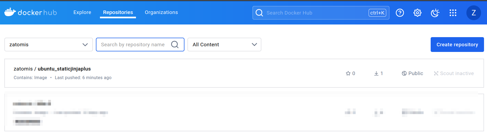
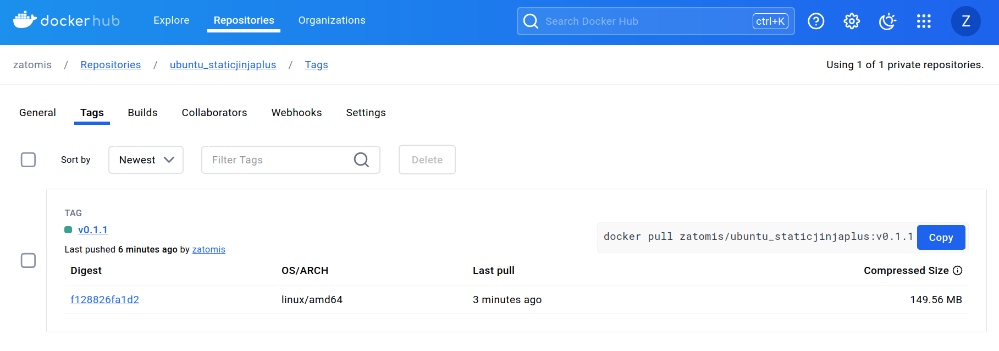

# Докеризируем генератор статических сайтов 

### Установка docker

[Установите Docker](https://docs.docker.com/engine/install/ubuntu/).

Проверьте, что `docker` установлен и корректно настроен. Запустите его в командной строке:
```shell
docker --version
```

### Образец готового образа доступен на [Docker hub](https://hub.docker.com/r/zatomis/static-jinja-plus).
Так же вы можете собрать свои образы.
Вот несколько вариантов установок 

Создайте докер файл
```shell
touch dockerfile
```
с содержанием :
```
FROM ubuntu:22.04
ARG JINJA_HASH
ARG JINJA_LINK=https://github.com/MrDave/StaticJinjaPlus/archive/refs/tags/$JINJA_VER.tar.gz
RUN apt-get update && apt-get install -y curl python3.10 python3-pip && rm -rf /var/lib/apt/lists/*
WORKDIR /"jinja"
ADD --checksum=sha256:$JINJA_HASH $JINJA_LINK /tmp/app.tar.gz
RUN tar xzf /tmp/app.tar.gz --strip-components=1 -C /jinja && rm /tmp/app.tar.gz
RUN pip install --no-cache-dir -r requirements.txt
RUN mv templates_example templates 
ENTRYPOINT ["python3", "main.py"]
```
данный файл создает образы для 
- 0.1.0-ubuntu
- 0.1.1-ubuntu

где в качестве параметров используем JINJA_VER - № тега сборки `JINJA_VER="0.1.0"` `JINJA_VER="0.1.1"` и JINJA_HASH - хеш файла sha256 (его нужно знать заранее), для проверки на подлинность 
имя файла для сборки используйте стандартное Dockerfile, например 

```shell
docker build -t ubuntu_staticjinjaplus:v1 --build-arg JINJA_VER="0.1.0" --build-arg JINJA_HASH="3555bcfd670e134e8360ad934cb5bad1bbe2a7dad24ba7cafa0a3bb8b23c6444" .
```

Следующий файл применим для сборок
- 0.1.0-slim
- 0.1.1-slim

```
FROM python:3.10.14-slim-bookworm
ARG JINJA_HASH
ARG JINJA_LINK=https://github.com/MrDave/StaticJinjaPlus/archive/refs/tags/$JINJA_VER.tar.gz
WORKDIR /jinja
ADD --checksum=sha256:$JINJA_HASH $JINJA_LINK /tmp/app.tar.gz
RUN tar xzf /tmp/app.tar.gz --strip-components=1 -C /jinja && rm /tmp/app.tar.gz
RUN pip install --no-cache-dir -r requirements.txt
RUN mv templates_example templates 
ENTRYPOINT ["python3", "main.py"]
```

где в качестве параметров - теги сборок такие как `JINJA_VER="0.1.0"` `JINJA_VER="0.1.1"` 
```shell
docker build -t slim_staticjinjaplus:v3 --build-arg JINJA_VER="0.1.0" --build-arg JINJA_HASH="3555bcfd670e134e8360ad934cb5bad1bbe2a7dad24ba7cafa0a3bb8b23c6444" .
```

Для сборки последней актуальной версии используем скрипт :
для - ubuntu
```
FROM ubuntu:22.04
RUN apt-get update && apt-get install -y git python3.10 python3-pip python3-venv && rm -rf /var/lib/apt/lists/*
WORKDIR /"jinja"
ADD https://github.com/MrDave/StaticJinjaPlus.git .
RUN pip install --no-cache-dir -r requirements.txt
RUN mv templates_example templates 
ENTRYPOINT ["python3", "main.py"]
```

```shell
docker build . --progress=plain --no-cache -t ubuntu_staticjinjaplus:latest .
```

для - python-slim
```
FROM python:3.10.14-slim-bookworm
RUN apt-get update && apt-get install git -y && rm -rf /var/lib/apt/lists/*
WORKDIR /"jinja"
ADD https://github.com/MrDave/StaticJinjaPlus.git .
RUN pip install --no-cache-dir -r requirements.txt
RUN mv templates_example templates 
ENTRYPOINT ["python3", "main.py"]
```

```shell
docker build . --progress=plain --no-cache -t slim_staticjinjaplus:latest .
```

```shell
docker build . --progress=plain --no-cache -t python_staticjinjaplus:latest .
```

# Запуск образа
Воспользуйтесь командой ниже. `Запуск всех образов аналогичен, за исключение указания номера версии сборки образа`
```shell
docker run -v "$(pwd)"/site:/jinja/build --rm -it django:v [1,2,3]->указать номер версии образа
```
После выполнения в текущем каталоге появится папка site с готовым шаблоном 

# Публикация образа на [Docker Hub](https://hub.docker.com/)

- Регистрация https://hub.docker.com/
- Подключение к аккаунту через запуск команды docker login в терминале. Docker попросит ввести имя пользователя и пароль
- Создание репозитория с вашем именем в личном кабинете

Теперь, чтобы загрузить образ в Docker Hub, мы должны дать ему правильное имя. По соглашению, часть имени Docker-образа до символа /, должна совпадать с именем вашего пользователя Docker Hub. Чтобы так сделать, вам необходимо пересобрать сборку еще раз:
```shell
docker build -t <имя вашего пользователя>/<название оббраза> .
```
Теперь можно пушить:
```shell
docker build -t <имя вашего пользователя>/<название образа> .
```
`По умолчанию отправляется тег latest !`
```shell
docker push <имя вашего пользователя>/<название образа>
```
Если репозиторий публичный, то скачать и запустить этот образ сможет любой, с доступом в интернет.
Теги у Docker-репозиториев изменяемые. Если изменить образ и снова его запушить с тем же тегом, образ поменяется. Для тега latest это ожидаемое поведение, а вот для версий нет. За этим нужно следить самостоятельно и не менять образ для уже существующих тегов. Если меняется образ, то правильно создавать новый тег:
```shell
docker build -t <имя вашего пользователя>/<название образа>:v1 .
```
```shell
docker push <имя вашего пользователя>/<название образа>:v1
```


# Пример публикации образа на [Docker Hub](https://hub.docker.com/)
Для примера возьмем за основу сборку образа `ubuntu` и создаем его уже с нашем именем на докер хаб
```shell
docker build -t `zatomis`/ubuntu_staticjinjaplus:v0.1.1 --build-arg JINJA_VER="0.1.1" --build-arg JINJA_HASH="30d9424df1eddb73912b0e2ad5375fa2c876c8e30906bec91952dfb75dcf220b" .
```
проверим
```shell
docker image ls
```


Образ создан.

Авторизируемся на DockerHub


И делаем push


Наш образ успешно размещен на докер хаб




## Цели проекта

Код написан в учебных целях. Cайт [Devman](https://dvmn.org). 
